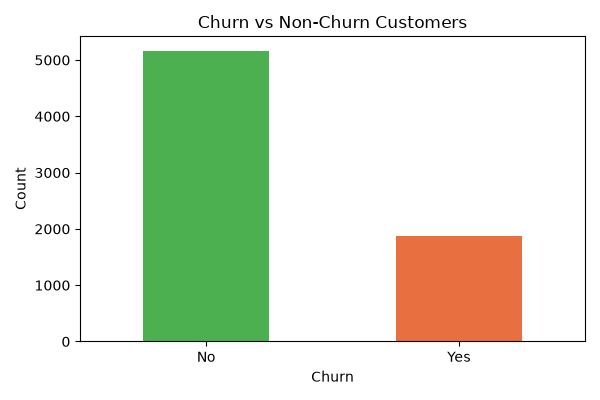
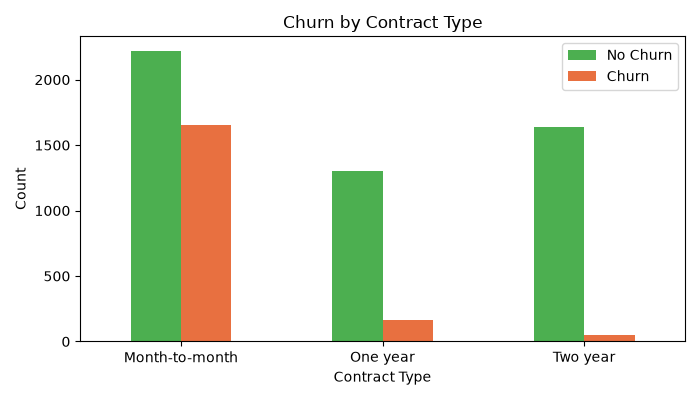

# Customer Churn Analysis

## Overview
Analyzed 7,032 telecom customer records to identify 
churn patterns and built a ML model to predict churn.

## Tools Used
- Python (Pandas, Matplotlib, Seaborn, Scikit-learn)
- Power BI (Interactive Dashboard)

## Key Insights
1. Churn Rate: 26.6% — 1 in 4 customers leaving
2. Month-to-month contract customers churn the most
3. Higher monthly charges = more churn
4. New customers (0-5 months) churn the most

## Model Performance
- Algorithm: Logistic Regression
- Accuracy: 78.75%

## Dashboard Preview

